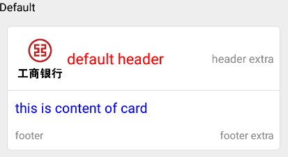
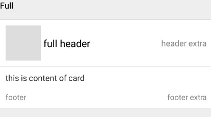

# Card

## Usage

  #!js
  import React, { Component } from 'react';
  import {Text,View} from 'react-native';
  import { Card } from 'IFTide';

  export default class Card_Demo extends Component { 
    render() {
        const imageSrc = "http://photocdn.sohu.com/20130419/Img373254302.jpg";
        return (
          <View> 
            <Text style={{fontSize: 15,color: 'black'}}>Default</Text>
            <Card
              header='default header'
              imageSource={imageSrc}
              headerStyle={{ color: 'red', fontSize: 20 }}
              headerExtra='header extra'
              body='this is content of card'
              bodyStyle={{ color: 'blue', fontSize: 18}}
              footer='footer'
              footerExtra='footer extra'
            /> 
          </View>
        );
      }
  }

  #!js
  render() {
       return (
	  <View> 
            <Text style={{fontSize: 15,color: 'black'}}>Full</Text>
            <Card full
              header='full header'
              headerExtra='header extra'
              body='this is content of card'
              footer='footer'
              footerExtra='footer extra'
            /> 
          </View>
       );
  }

## Card Props
| prop | default | type | description   |
| --------- | --------- | --------- | --------- |
| full | false | boolean | card视图是否全屏显示 |
| imageSource | none | string | 网络图片路径 |
| header | none | string | header文本内容 |
| headerExtra | none | string | headerExtra文本内容 |
| headerStyle | color:'#000000' fontSize:18 | oneOf(array,number,object) | header文本样式 |
| headerExtraStyle | color:'#888888' fontSize:15 | oneOf(array,number,object) | headerExtra文本样式 |
| body | none | string | card正文内容 |
| bodyStyle | color:'#333333' fontSize:15 | oneOf(array,number,object) | card正文文本样式 |
| footer | none | string | footer文本内容 |
| footerExtra | none | string | footerExtra文本内容 |
| footerStyle | color:'#888888' fontSize:14 | oneOf(array,number,object) | footer文本样式 |
| footerExtraStyle | color:'#888888' fontSize:14 | oneOf(array,number,object) | footerExtra文本样式 |

!!! note
    headerStyle,headerExtraStyle,bodyStyle,footerStyle,footerExtraStyle样式设置中仅支持<Text>的样式设置，如color,fontSize,fontFamily等
