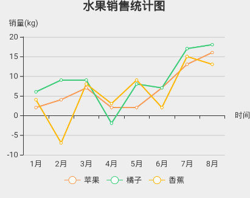
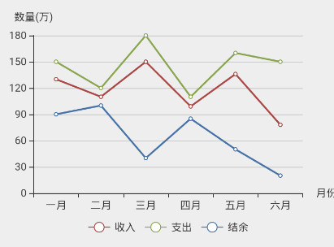

# LineChart

## Usage

  #!js
  import React, { Component } from 'react';
  import {Text,View} from 'react-native';
  import { LineChart } from 'IFTide';

  const props = {
    title: '水果销售统计图',
    height: 300,
    //width: 300,
    xLabel: '时间',
    xData: ['1月', '2月', '3月', '4月', '5月', '6月', '7月', '8月'],
    yLabel: '销量(kg)',
    data: [
      {label:'苹果',color:'rgb(249,159,94)',value:[2, 4, 7, 2, 2, 7, 13, 16]},
      {label:'橘子',color:'rgb(67,205,126)',value:[6, 9, 9, -2, 8, 7, 17, 18]},
      {label:'香蕉',color:'rgb(255,185,15)',value:[4, -7, 8, 3, 9, 2, 15, 13]}
    ]
  };

  export default class LineChart_Demo extends Component { 
    render() {
        return (
            <View >
                <LineChart {...props} />   
            </View>
        );
      }
  }

  #!js
  const props = {
    height: 300,
    xLabel: '月份',
    xData: ['一月', '二月', '三月', '四月', '五月', '六月'],
    yLabel: '数量(万)',
    data: [
      {label:'收入',color:'#aa4643',value:[130, 110, 150, 99, 136, 78]},
      {label:'支出',color:'#89a54e',value:[150, 120, 180, 110, 160, 150]},
      {label:'结余',color:'#4572a7',value:[90, 100, 40, 85, 50, 20]}
    ]
  };
  render() {
       return (
	  <View> 
            <LineChart {...props} /> 
          </View>
       );
  }

## LineChart Props
| prop | default | type | description   |
| --------- | --------- | --------- | --------- |
| title | none | string | 折线图标题 |
| xLabel | none | string | x轴名称 |
| xData | none | array | x轴数据 |
| yLabel | none | string | y轴名称 |
| data | none | array | 折线图数据 |
| height | none | number | 折线图高度 |
| width | 屏幕宽度 | number |  折线图宽度 |

!!! note
    data中数据具体格式详见demo。height和data为必要参数。