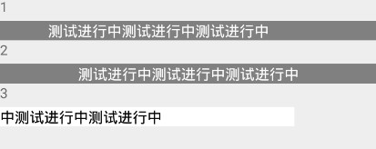

# NoticeBar

## Usage

  #!js
  import React, { Component } from 'react';
  import {Text,View} from 'react-native';
  import { NoticeBar } from 'IFTide';

  export default class NoticeBar_Demo extends Component { 
    render() {
        return (
            <View >
            <Text>1</Text>
            <NoticeBar
              scroll={true}
              duration={5}
              text={'测试进行中测试进行中测试进行中'}
              textColor={'white'}
              backgroundColor={'grey'} 
              delay={0}
            />
            <Text>2</Text>
            <NoticeBar
              scroll={false}
              duration={5}
              text={'测试进行中测试进行中测试进行中'}
              textColor={'white'}
              backgroundColor={'grey'}
              delay={0}
            />
            <Text>3</Text>
            <NoticeBar
              scroll={true}
              duration={4}
              text={'测试进行中测试进行中测试进行中'}
              textColor={'black'}
              backgroundColor={'white'}
              height={20}
              width={300}
              delay={0}
            />  
          </View>
        );
      }
  }

## NoticeBar Props
| prop | default | type | description   |
| --------- | --------- | --------- | --------- |
| scroll | false | boolean | 文本是否滚动 |
| text | none | string | 需要进行滚动的文本 |
| textColor | white | string | 文本颜色 |
| backgroudColor | grey | string | 外部框背景颜色 |
| height | 20 | number | 外部框高度 |
| width | none | number | 外部框宽度 |
| duration | 5 | number | 文本滚动一次所需时间 |
| delay | 0 | number | 每次滚动前延迟时间 |

!!! note
    duration和delay单位为秒